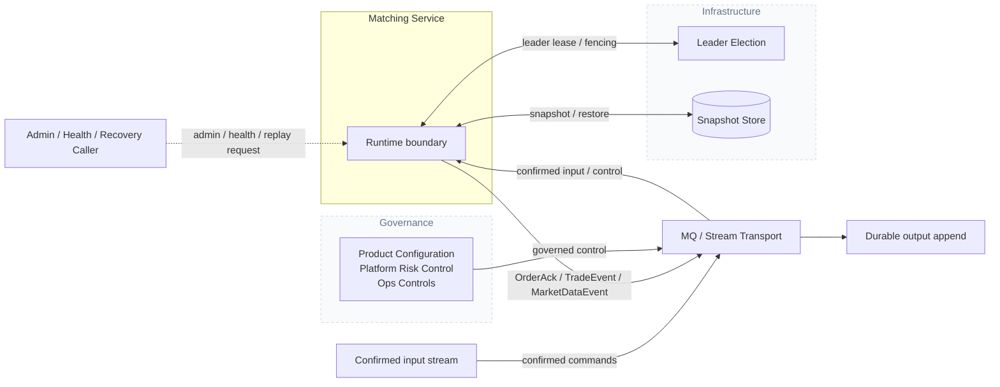
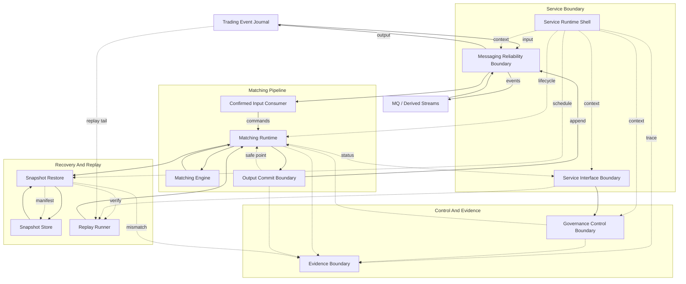

# Matching Core

[English](README.md) | [中文](README.zh-CN.md)

Matching Core is a deterministic matching library for a Matching Service.

This repository is not the whole exchange and not yet the production service process. It is the part that must stay explainable under replay: confirmed input goes in, order books change in a deterministic way, matching output is committed durably, and safe points move only after that output is known to be durable.

## What This Repo Owns

- Per-symbol order book state.
- Price-time priority matching behavior.
- Confirmed-input routing into symbol runtimes.
- Bounded handoff and runtime pressure signals.
- Output commit tracking before safe-point advancement.
- Snapshot, restore, replay, checksum, and verification primitives.

It does not own order-entry APIs, account balances, custody, settlement, fee calculation, or external market-data fan-out. Those belong to neighboring services.

## Architecture

The diagrams below mirror the Matching Service architecture reference.

### Service Context



### Component View



`Matching Runtime` owns runtime topology, symbol-runtime placement, routing, and bounded handoff. Symbol Routing, Bounded Handoff, Symbol Runtime, Shard Runtime, and Shard Execution Core are internal runtime responsibilities, so they are described in the runtime ownership model rather than drawn as standalone components here. `Matching Engine` owns deterministic execution and order-book mutation through its internal order-book state structure. `Snapshot Restore` and `Replay Runner` operate on a selected symbol / symbol group and sequence range; they are not drawn as one component per trading pair. Snapshot bytes and verified manifests are stored artifacts, so they are described in the component responsibility text rather than drawn as components.

## Current State

The core crate already has working pieces for:

- Domain types, command validation, limit orders, cancellation, acknowledgements, trades, and market events.
- Deterministic bid / ask books with FIFO price levels, indexed cancellation, checksum, snapshot, and restore.
- Multi-symbol runtime management, symbol routing, bounded handoff queues, configured inline matching runtime runs, input-batch preflight, drain boundaries, pending output pressure, and runtime policy configuration.
- Output batch identity, output commit retry / query handling, and safe-point advancement after durable output.
- Replay, snapshot storage, verified manifests, and snapshot verification evidence.

The service crate is still a boundary under construction. Public APIs, deployment, production operations, and benchmark reporting are not finished here yet.

## Development

Useful commands:

```bash
cargo fmt -p matching-core
cargo test -p matching-core
```

Run the full workspace when service-level changes are involved:

```bash
cargo test
```

Commit messages use concise Conventional Commit style:

```text
feat(core): add shard runtime scheduling
```

## Documentation

The full Matching Service architecture reference is maintained outside this repository. The repository-local roadmap lives in:

```text
docs/roadmap.md
```
