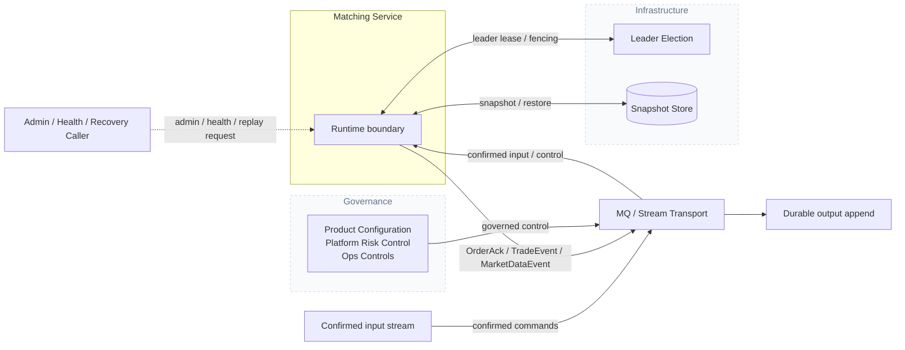
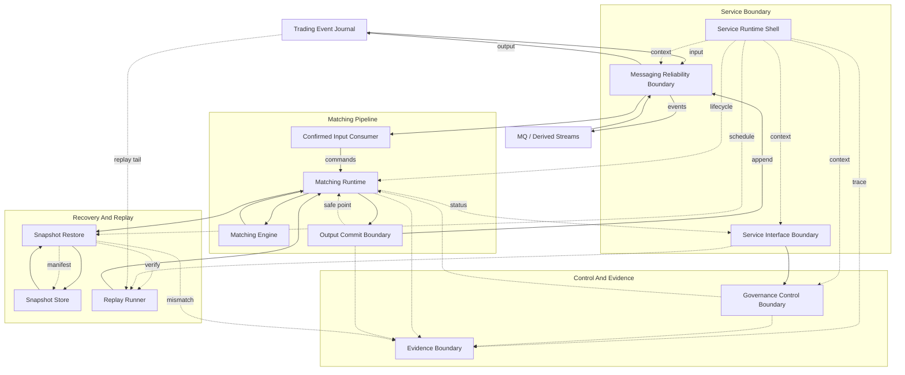

# Matching Core

[English](README.md) | [中文](README.zh-CN.md)

Matching Core 是面向 Matching Service 的确定性撮合库。

这个仓库不是完整交易所，也还不是生产级 service process。它负责那条必须能被 replay 解释清楚的核心路径：confirmed input 进入系统，order book 以确定性方式变化，matching output 先完成 durable commit，然后 safe point 才能推进。

## 这个仓库负责什么

- 每个 symbol 的 order book state。
- Price-time priority 撮合行为。
- Confirmed input 到 symbol runtime 的路由。
- Bounded handoff 和 runtime pressure signal。
- Safe point 推进前的 output commit tracking。
- Snapshot、restore、replay、checksum 和 verification primitives。

它不负责 order-entry API、account balance、custody、settlement、fee calculation 或对外 market-data fan-out。这些属于相邻服务。

## 架构

下面两张图对齐 Matching Service 架构参考。

### Service Context



### Component View



`Matching Runtime` 负责 runtime topology、symbol-runtime placement、routing 和 bounded handoff。Symbol Routing、Bounded Handoff、Symbol Runtime、Shard Runtime 和 Shard Execution Core 属于 runtime 内部职责，所以在 runtime ownership model 中描述，而不在这里作为独立组件绘制。`Matching Engine` 负责确定性执行，并通过内部 order-book state structure 修改 order book。`Snapshot Restore` 和 `Replay Runner` 面向选定的 symbol / symbol group 和 sequence range 工作，不按每个 trading pair 画成单独组件。Snapshot bytes 和 verified manifests 是持久化 artifact，所以放在组件职责文本中说明，而不是画成 live runtime component。

## 当前状态

`matching-core` crate 目前已经覆盖：

- Domain types、command validation、limit order、cancel、ack、trade 和 market event。
- 确定性的 bid / ask book、同价位 FIFO、indexed cancellation、checksum、snapshot 和 restore。
- Multi-symbol runtime management、symbol routing、bounded handoff queue、configured inline matching runtime run、input-batch preflight、drain boundary、pending output pressure 和 runtime policy config。
- Output batch identity、output commit retry / query handling，以及 durable output 之后的 safe-point advancement。
- Replay、snapshot storage、verified manifest 和 snapshot verification evidence。

`matching-service` crate 仍然是建设中的 service boundary。公开 API、部署、生产运维和 benchmark 报告还没有在这个仓库里完成。

## 开发

常用命令：

```bash
cargo fmt -p matching-core
cargo test -p matching-core
```

涉及 service-level 改动时，运行完整 workspace：

```bash
cargo test
```

Commit message 使用简洁的 Conventional Commit 风格：

```text
feat(core): add shard runtime scheduling
```

## 文档

完整的 Matching Service 架构参考维护在这个仓库外。仓库内 roadmap 在：

```text
docs/roadmap.md
```
